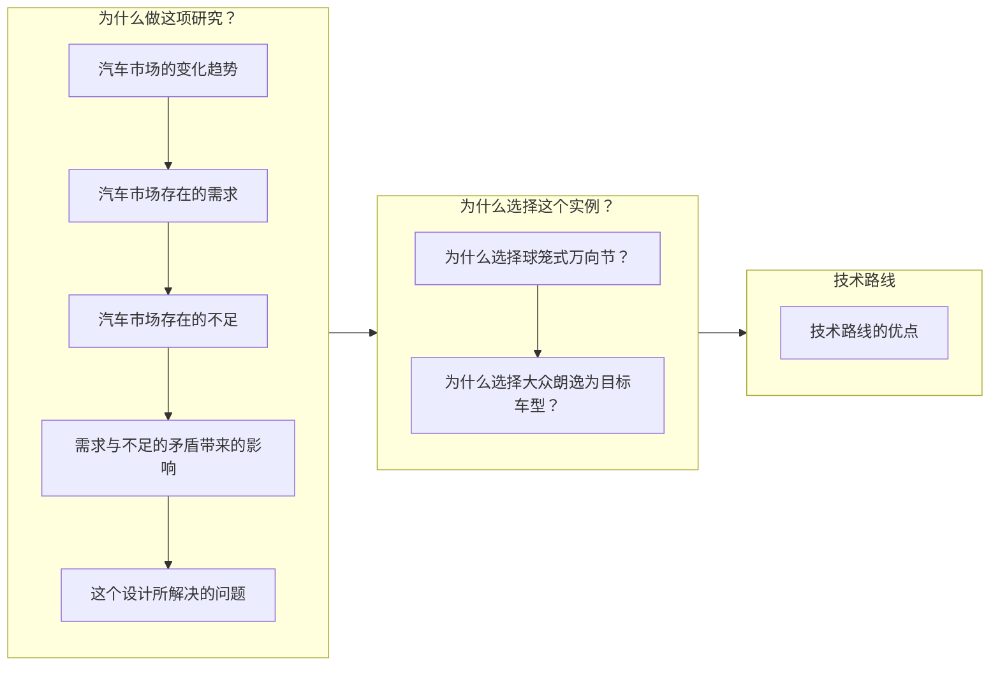

1. 背景

```mermaid
flowchart LR
	subgraph g1[为什么做这项研究？]
		direction TB
		n1[汽车市场的变化趋势]
		n2[汽车市场存在的需求]
		n3[汽车市场存在的不足]
		n4[需求与不足的矛盾带来的影响]
		n5[这个设计所解决的问题]
		n1-->n2-->n3-->n4-->n5
	end
	
	subgraph g2[为什么选择这个实例？]
		direction TB
		n6[为什么选择球笼式万向节？]
		n7[为什么选择大众朗逸为目标车型？]
		n6-->n7
	end
	
	subgraph g3[技术路线]
		direction TB
		n8[技术路线的优点]
	end
	
	g1-->g2-->g3
```
